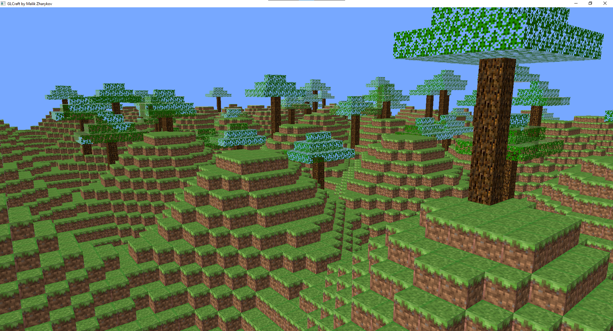
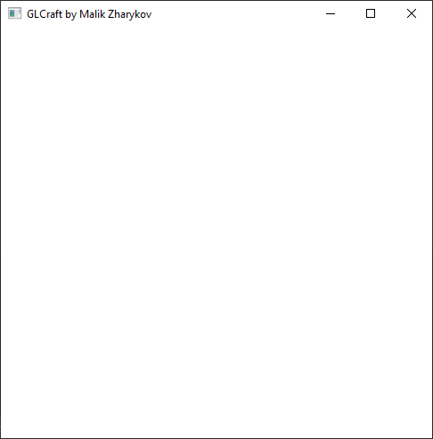
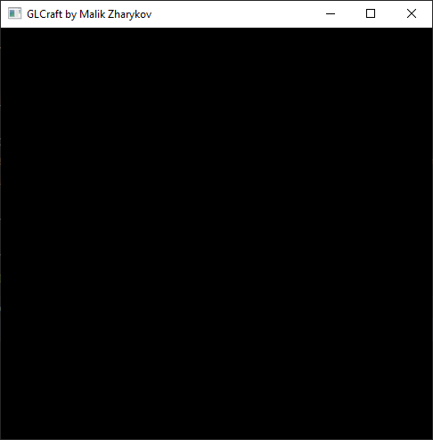
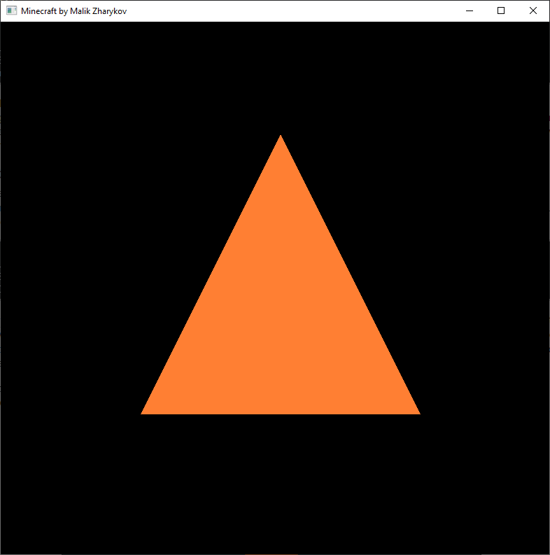
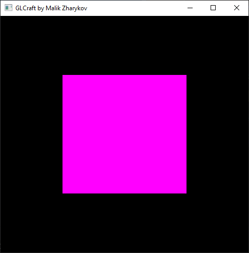
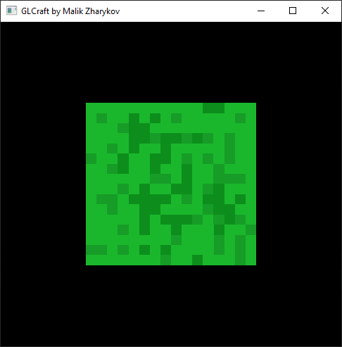
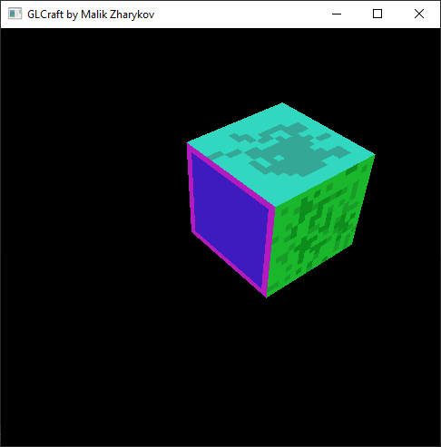
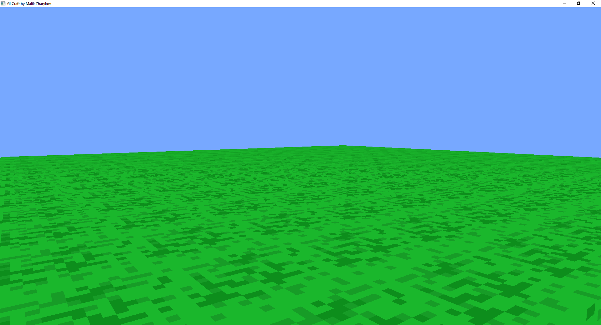
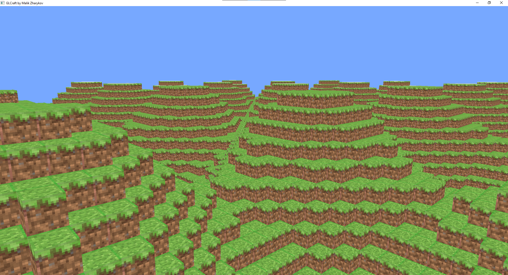
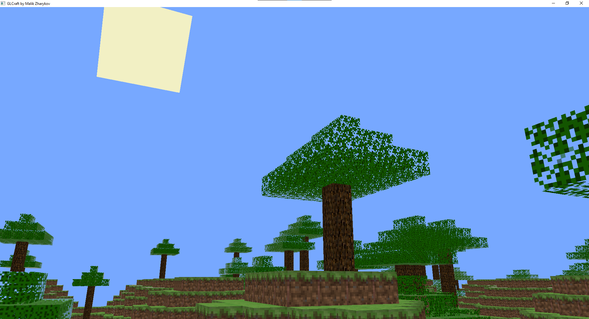

# Практическая работа ( Minecraft )

Попробовал сделать подобие майнкрафта с помощью OpenGL и C++

## DevLog

В начале я настроил окно, контекст OpenGL и т.д. и вот что у меня получилось:

Потом я прикрутил OpenGL и наконец-то увидел черное окно:

Далее, я настроил шейдеры, вершины и попробовал отрисовать треугольник:

После этого я уже перешёл к квадрату :)

Потом, я настроил загрузку текстур и прикрутил текстуру к квадрату

Далее, я настроил матрицы перспективной проекции, и т.д. и уже получился куб:

Потом, (самое трудное) написал простейший алгоритм мешинга и попробовал уже нарисовать меш:

Дальше, я не стал париться, с шумом Перлина и т.д. и в качестве функции для генерации ландшафта, я использовал обыкновенный косинус)

Написал код для генерации деревьев, создал солнце:

Потом я настроил освещение, выполнив скалярное произведение вектора нормали вершины на вектор направления освещение и там все дела:

И это на картинках так всё просто, на самом деле багов было очень много и пришлось всё это дебажить и т.д.
Так сказать, "искать соломинку в стогу иголок".

Но, результат меня устраивает))
